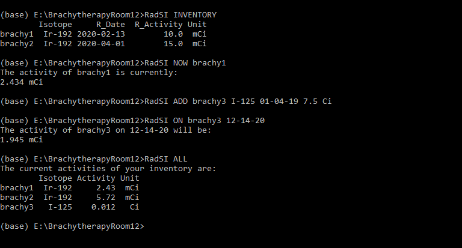

# RadSI - The Radiation Source Inventory

I recently developed a CLI application that allows you to keep track of the activity of various radioactive sources in your "inventory". It's a simple application, mainly developed to practice various development skills with python, but I believe it could be useful to people who work with radioactive sources! My brief experience with irradiation facilities and medical physics revealed that often source activities are kept track of via look up tables in binders. Simple and useful, but there can be a better way! With RadSI, you can use simple commands to add sources to the inventory, find out the current activity or activity at a specified date-time, or even find out when a source will be at a particular activity. A snapshot of RadSI in action can be seen below:

Based on preliminary feedback, instillation and use is simple – independent of Python experience.

You can find the [GitHub Repository here](https://github.com/matthewdurbin/RadSI), or get started with:

    pip install RadSI

